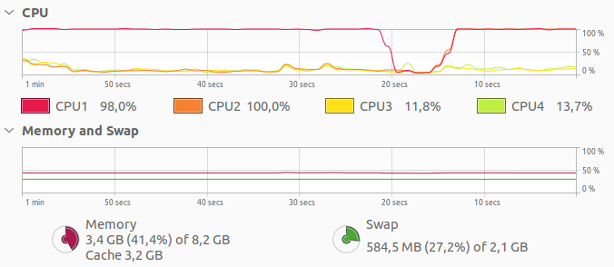
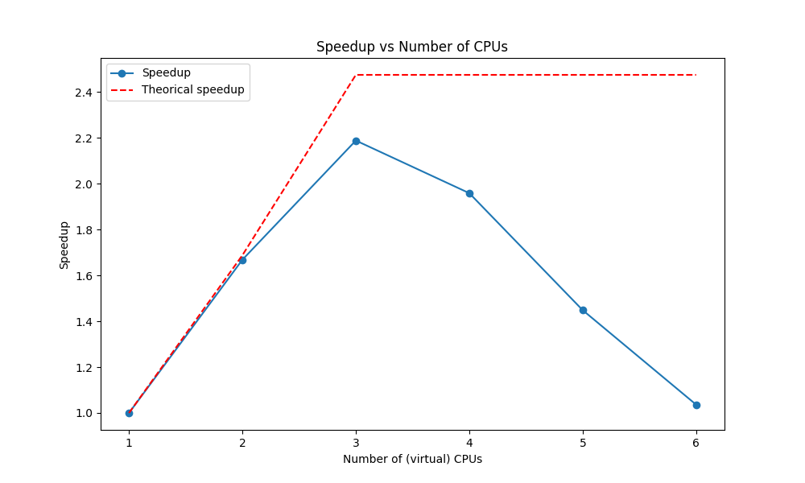

# Fourmi2024

Tous les résultats présentés dans ce document ont été obtenus en exécutant le script `basic_tests.sh`. Celui-ci exécute 
toutes les simulations présentées ici, et trace le graphe correspondant. De plus, il s'assure que numpy ne fera pas de 
calculs en parallèle, afin de ne pas fausser les résultats. Enfin, il laisse un temps de pause entre les exécutions qui 
est assez court pour que les conditions d'exécutions soit similaires, mais assez long pour que le cache dû à l'exécution 
précédente puisse se vider.  

Je précise que mon ordinateur possède seulement 4 processeurs, qui ne sont pas subdivisables.  

Dans les deux premières sections, on utilisera les paramètres suivants pour la simulation :
- size_laby = 25, 25
- max_life = 500
- alpha = 0.9
- beta = 0.99

Ces paramètres ont été choisis car ils permettent d'obtenir une simulation assez rapide, tout en étant suffisamment 
complexe pour que l'on puisse observer des différences de performances entre les différentes parallélisations. De plus, 
ils donnent lieu à une simulation plutôt intéressante (la nourriture est trouvée).  


## Analyse du problème

En faisant tourner la simulation sur `max_exec_cycle` = 5000 cycles, qui correspond au moment où l'on atteint un "régime 
stationnaire", on obtient les résultats suivants :  

```shell
$ mpirun -np 1 python3 ants.py 25 25 500 0.9 0.99 5000
nbp = 1, Cycle: 5000 / 5000, 
Temps total : 38.52307 sec, 
Temps total affichage : 15.53173 sec, 
Temps total calcul fourmis : 22.78627 sec, 
Temps total evapo phéromones : 0.03914 sec, 
FPS : 145.09, 
nourriture :    2336 

```


Ainsi, il parait pertinent de séparer l’affichage de la simulation de la mise à jour des fourmis et des phéromones.
En effet, l’affichage prend environ $40$ % du temps total d'exécution, ce qui est loin d'être négligeable. Ainsi, en 
observant que $t_{evapo} << t_{affichage}$, on peut espérer au mieux le speedup suivant :  

$S_1 = \frac{t_{total}}{\max(t_{affichage}, t_{fourmis})} = \frac{t_{total}}{t_{fourmis}} \approx 1.7$

**Remarque** : On a supposé que $t_{communication} << t_{affichage}$, il faudra vérifier cette hypothèse.  

Par ailleurs, chaque fourmi ayant un comportement indépendant des autres (aux phéromones près), il semble astucieux de 
paralléliser leur calcul. Il suffirait de 2 processeurs pour que $t_{affichage}$ devienne le facteur limitant :  

$t_{fourmis}^{&#x2032} = \frac{t_{fourmis}}{2} \approx 11.4 \text{ sec} < t_{affichage} = 15.53173 \text{ sec}$

Ainsi, avec cette méthode, on pourrait espérer un speedup $S_2 = \frac{t_{total}}{t_{affichage}} \approx 2.5$.

Reste le calcul de l'évaporation des phéromones, qu'il est également possible de paralléliser car chaque case y est 
indépendante des autres. Cependant, au vu de la faiblesse du temps d'exécution représenté par cette fonction, on 
laissera son exécution au processeur principal (0).  

Ainsi, pour l'instant, il semble inutile d'utiliser plus de 3 processeurs pour cette accélérer cette simulation. On 
réfléchira à nouveau à cette question après avoir parallélisé la simulation avec les méthodes précédentes.  

Enfin, on remarque que ce programme est majoritairement **CPU-bound**. Ou du moins tant que le nombre de fourmis, leur 
age maximum (qui influe sur la taille de l'historique), et la taille de la carte ne sont pas trop grands. Ainsi, on peut 
s'attendre à un gain important de performance en parallélisant la simulation, tant qu'elle reste raisonnable.  


## Stratégies de parallélisation

### Séparation de l'affichage

On va créer deux processus MPI différents, l'un pour l'affichage, l'autre pour le calcul des fourmis. Ainsi, le 
processus principal (0) exécutera `ants_display_monoprocess.py`, tandis que le processus secondaire (1) exécutera 
`ants_computation_monoprocess.py`.  

Afin de séparer l'affichage et le calcul des fourmis, on va créer deux classes différentes "parentes" à `Colony`. L'une,
`Colony_compute`, reprendra tous les éléments de `Colony` à l'exception des éléments liés à l'affichage. L'autre,
`Colony_display`, concentrera les éléments liés à l'affichage. De plus, dans `Colony_compute`, on remplace les appels à 
`a_maze.maze` par `a_maze` (qui aura bien évidemment la forme attendue). Cela évite au programme `ants_computation_monoprocess.py` 
d'utiliser pygame, et ne change strictement rien au fonctionnement de la classe. Les deux classes sont placées dans le 
fichier `colony.py`.  

Au début de la simulation, le processeur principal initialisera toutes les constantes de la simulation (potentiellement 
rentrées par l'utilisateur), et les partagera au processeur secondaire (1). Ensuite, à chaque cycle, le processeur 
principal enverra au processeur secondaire la matrice des phéromones et recevra en retour les attributs de 
`Colony_compute` nécessaires à l'affichage (position des fourmis, etc.). Le processeur principal recevra également 
le nouveau `food_counter`, ainsi que la nouvelle matrice des phéromones, dont il calculera l'évaporation.  

```shell
$ mpirun -np 1 python3 ants_display_monoprocess.py 25 25 500 0.9 0.99 5000 : -np 1 python3 ants_computation_monoprocess.py
nbp = 2, 
Cycle: 5000 / 5000, 
Temps total : 23.09369 sec, 
Temps total affichage : 16.00114 sec, 
Temps total comm de P0 : 0.11892 sec, 
Temps total attente de P0 : 6.00888 sec, 
Temps total comm vers P0 : 0.42337 sec, 
Temps total evapo phéromones : 0.07877 sec, 
FPS : 212.32, 
nourriture :    2336 

```



On retrouve bien `food_counter` $= 2336$, ce qui nous rassure sur le bon fonctionnement de notre parallélisation.  

On observe que $t_{communication} << t_{affichage}$, ce qui est une très bonne nouvelle : on a réussi à établir une 
communication efficace entre les deux processus. Par ailleurs notre temps d'exécution totale est très proche du temps de 
calcul des fourmis que l'on obtenait précédemment, ce qui est très encourageant ! En effet, cela signifie que notre 
parallélisation est quasi-parfaite. D'ailleurs, le speedup que l'on obtient est quasiment celui que l'on avait prédit :  

$S = \frac{38.52307}{23.09369} \approx 1.67 \equiv S1 \approx 1.7$

On a donc à la fois une très bonne parallélisation et une communication très efficace. On va donc pouvoir passer à la 
parallélisation des fourmis.  

**Remarque** : Le temps d'attente de P0 correspond au temps que le processeur principal passe à attendre que le
processeur secondaire ait fini de calculer les fourmis. On voit qu'il est très proche de $t_{fourmis} - t_{affichage}$, 
ce qui est logique.  


### Séparation des fourmis

L'idée ici est de séparer les fourmis en plusieurs groupes, chacun étant géré par un processus MPI différent. Pour cela,
on va créer plusieurs instances de `Colony_compute` (une par processus), et chacune comptera qu'une partie des fourmis, 
la somme des fourmis de toutes les sous-colonies étant égale au nombre total de fourmis.  

Mais on se heurte alors à deux problèmes : un lié à la gestion du pseudo-hasard, et l'autre à la gestion des 
phéromones. Tous deux ont besoin d’être bien réfléchis afin de garder une cohérence dans la simulation, i.e. un 
déterminisme indépendant du nombre de processus utilisés.  

#### Le problème du pseudo-hasard

La manière dont le hasard est généré pour le déplacement des fourmis est lié au seeds de la colonie. Il faut donc 
s'assurer que le fait de séparer les fourmis en plusieurs groupes ne change pas les valeurs de leur seeds. Pour cela, 
il faut d'abord s'assurer qu'elles sont bien égales dès le début, ce qui se fait facilement en ajoutant en paramètre 
à l'initialisation de `Colony_compute` le numéro de la première fourmi. Ensuite, il faut s'assurer que les seeds 
évoluent bien de manière indépendante pour chaque fourmi. C'est à priori le cas, sauf à la ligne `132.` de `ants.py` :  
```python
129.  while np.any(valid_moves[ind_exploring_ants] == 0):
130.      # Calculating indices of ants whose last move was not valid:
131.      ind_ants_to_move = ind_exploring_ants[valid_moves[ind_exploring_ants] == 0]
132.      self.seeds[:] = np.mod(16807*self.seeds[:], 2147483647)
```

Ici, on voit que les seeds de toutes les fourmis vont être modifiées, indépendamment de la fourmis responsable de 
l'entrée dans la boucle. C'est un problème, car cela signifie qu'une sous-colonie entrera potentiellement moins de fois 
dans cette boucle que la colonie principale, et donc que les seeds de ses fourmis vont diverger de celles de cette 
dernière. Pour régler le problème, on va effectuer la modification suivante dans `ants.py` :  
```python
132.      self.seeds[ind_ants_to_move] = np.mod(16807*self.seeds[ind_ants_to_move], 2147483647)
```

**Précision** : Afin de garder une cohérence dans les éxécutions des différents programmes, cette modification aura été 
faite en amont de tous les résultats présentés dans ce document.

#### Le problème du marquage des phéromones

La manière dont les phéromones sont marqués à la fin de la méthode `advance` de `Colony` est problématique. En effet, 
elle est faite dans un certain ordre, et modifie la matrice des phéromones au cours de son éxécution. Or, la fonction 
$p(h)$ qui est utilisée pour le marquage des phéromones utilise les cases voisines de $h$. Ainsi, on ne peut pas exécuter 
la ligne suivante sur des sub-colonies sans risquer de modifier la matrice des phéromones de manière incohérente :  
```python
[pheromones.mark(self.historic_path[i, self.age[i], :],
                [has_north_exit[i], has_east_exit[i], has_west_exit[i], has_south_exit[i]]) for i in range(self.directions.shape[0])]
```

Un solution possible est de marquer les phéromones en utilisant l'état de `pheromones.pheromon` datant de la fin du 
cycle précédent. Cela modifie certes un peu la diffusion des phéromones, mais reste dans l'idée de ce qu'on cherche à 
faire. On va donc remplacer la ligne précédente par celles-ci :  
```python
old_pheromon = pheromones.pheromon.copy()
[pheromones.mark(self.historic_path[i, self.age[i], :],
                 [has_north_exit[i], has_east_exit[i], has_west_exit[i], has_south_exit[i]], old_pheromon) for i in range(self.directions.shape[0])]
```

**Remarque** : On a aussi modifié la méthode `mark` de `pheromones` pour qu'elle prenne en paramètre `old_pheromon`.  

**Précision** : De même, cette modification aura été faite en amont des éxécutions présentées ici.  

#### Détails sur la communication

Un dernier détail à régler et celui du regroupement des données à la fin de chaque cycle. Pour les fourmis, cela ne pose 
pas de soucis car elles sont indépendantes. On pourra donc réunir leurs informations par un simple `Gatherv` de MPI.  

En revanche, pour les phéromones, les matrices auront été modifiées différemment par chaque sous-colonie. Afin de les 
regrouper de manière cohérente, on va simplement prendre le maximum de chaque case de la matrice des phéromones. En 
effet, le marquage des phéromones via la fonction $p(h)$ ne pouvant que faire croître la valeur des phéromones (postulat 
que l'on admettra), la prise du maximum nous donnera bien la matrice des phéromones où l'on aura modifié les cases 
correspondantes aux fourmis de chaque sous-colonie.  
De même, on va ajouter au `food_counter` actuel la somme des `food_counter` de chaque sous-colonie (qu'on aura rémis à 0 
au début du cycle) pour obtenir le nouveau `food_counter`. Ainsi, on utilisera simplement un `Reduce` de MPI pour 
traiter ces deux informations.

Les programmes résultants sont donc des adaptations de ceux permettant la séparation de l'affichage et du calcul : `ants_display.py`
et `ants_computation.py`.

#### Résultats

```shell
$ mpirun -np 1 python3 ants_display.py 25 25 500 0.9 0.99 5000 : -np 2 python3 ants_computation.py
nbp = 3, 
Cycle: 5000 / 5000, 
Temps total : 17.60871 sec, 
Temps total affichage : 15.64027 sec, 
Temps total comm de P0 : 0.16643 sec, 
Temps total attente de P0 : 0.61481 sec, 
Temps total comm vers P0 : 0.64586 sec, 
Temps total evapo phéromones : 0.04678 sec, 
FPS : 312.45, 
nourriture :    2336 

```


Encore une fois, on retrouve bien `food_counter` $= 2336$. De plus, on observe que $t_{communication}$ a augmenté, mais 
est toujours négligeable devant $t_{affichage}$.  

Le plus intéressant est que le temps d'attente de P0 est devenu négligeable, ce qui signifie qu'on a bien 
$t_{fourmis}^{&#x2032} < t_{affichage}$. D'ailleurs le speedup obtenu est encore une fois très correct :  

$S = \frac{38.52307}{17.60871} \approx 2.19 \equiv S2 \approx 2.5$

Autre fait intéressant, visible sur le system monitor : les deux processus MPI chargé de calculer les fourmis ne sont 
pas toujours exécutés par les mêmes processeurs. Il est difficile de savoir si c'est dû à la manière dont MPI gère les 
processus, ou si c'est dû à la manière dont mon ordinateur gère les processus MPI.  

On va maintenant essayer d'ajouter un quatrième processeur qui gérera lui ausssi les fourmis, et voir si c'est bien 
inutile, comme prédit dans notre première analyse.

```shell
$ mpirun -np 1 python3 ants_display.py 25 25 500 0.9 0.99 5000 : -np 3 python3 ants_computation.py
nbp = 4, 
Cycle: 5000 / 5000, 
Temps total : 19.6711 sec, 
Temps total affichage : 16.96224 sec, 
Temps total comm de P0 : 0.46604 sec, 
Temps total attente de P0 : 0.32908 sec, 
Temps total comm vers P0 : 1.32192 sec, 
Temps total evapo phéromones : 0.05151 sec, 
FPS : 312.36, 
nourriture :    2336 
```


Bon ici, on voit que le temps d'affichage a légèrement augmenté, et ce apparement sans raison. Dans l'analyse suivante, 
on fera comme s'il n'avait pas bougé.  

Le temps d'attente de P0 a baissé, ce qui peut être dû à la plus grande rapidité du calcul des fourmis. En effet, 
même si en moyenne on avait $t_{fourmis}^{&#x2032} < t_{affichage}$, il est possible qu'il soit ponctuellement plus 
grand, ce qui aurait pu causer des attentes plus longues. L'ajout d'un processeur a donc permis de réduire ce temps.

Cependant, le temps de communication a encore augmenté, et ce plus que le temps d'attente de P0 n'a baissé. Résultat, 
le temps total d'exécution a légèrement augmenté. L'ajout d'un processeur n'a donc pas été bénéfique, comme prévu.  

Traçons le graphe de $S$ en fonction de `nbp` pour mettre ceci en perspective :  



**Remarque** : Pour 2 processus, on retrouve simplement la séparation de l'affichage et du calcul des fourmis.

Ici, la courbe théorique, qui néglige le temps de communication, correspond à :  

$y = \dfrac{t_{total}}{\max(t_{affichage}, \frac{t_{fourmis}}{nbp-1}) + t_{evapo}}$.

On remarque qu'au dela de 4 processeurs les performances chutent fortement. Cela est dû au fait que l'on a atteint la 
limite de mon ordinateur. Les nouveaux processus créés doivent donc être gérés par le système d'exploitation entre les 
différents processeurs, ce qui ralentit l'exécution.

#### Test de l'augmentation de la taille du labyrinthe

On va ici prendre un labyrinthe 4 fois plus grand, de taille 50*50. Pour rappel, lee nombre de fourmis évolue 
linéairement en fonction de cette taille : `nb_ants = size_laby[0] * size_laby[1] // 4`.

On utilise ici le script `advanced_test.sh` pour obtenir les résultats suivants :  

```shell
$ mpirun -np 1 python3 ants.py 50 50 1000 0.9 0.99 5000
nbp = 1, 
Cycle: 5000 / 5000, 
Temps total : 127.65242 sec, 
Temps total affichage : 53.1554 sec, 
Temps total calcul fourmis : 74.14684 sec, 
Temps total evapo phéromones : 0.03877 sec, 
FPS :  41.08, 
nourriture :    2509 
```

Ici, le temps d'affichage représente toujours environ 40 % du temps total d'exécution. De plus, la courbe obtenu en 
fonction de `nbp` est sensiblement la même que précédemment :


**Conclusion** : On peut donc avancer que les performances de notre parallélisation sont indépendantes de la taille du 
labyrinthe, ce qui vient renforcer les conclusions tirées précédemment.  


### Réflexion sur un partitionnement possible du labyrinthe

Comme on l'a vu, notre parallélisation est certes très efficace avec peu de processeurs, mais elle manque de scalabilité.
Pour remédier à cela, on pourrait imaginer un partitionnement du labyrinthe, où chaque processeur serait responsable 
du calcul et de l'affichage d'une partie du labyrinthe. Il faudrait alors résoudre les problèmes suivants :
- Comment gérer les fourmis qui se déplacent d'une partie à l'autre du labyrinthe ?
- Comment gérer les phéromones qui se diffusent d'une partie à l'autre du labyrinthe ?
- Comment gérer l'affichage de plusieurs parties du labyrinthe ?
- Comment synchroniser les différentes parties du labyrinthe pour que la simulation reste cohérente ?

Et surtout :
- Comment gérer la différence de charge entre les différents processeurs ?

En effet, cette dernier question risque vite de se poser. En effet, les fourmis risquent d'être souvent réparties de 
façon hétérogène dans le labyrinthe, notamment au début où elles sont toutes concentrées auu niveau du nid. On pourrait 
alors penser à utiliser un système maître-esclave, mais il est évident que cela pourrait engendrer des communications 
plus importantes... A voir où ce situerait le compromis optimal.
